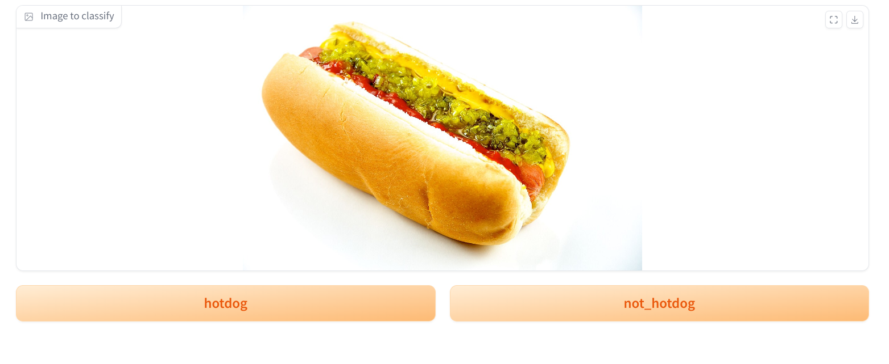

# gradio_image_labelling

Simple gradio app to manually label images.




## Installation
```bash
pip install -r requirements.txt
```

## Usage
```bash
python gradio_app.py \
    --output_file=annotations.json \
    --image_root=./data_to_label/ \
    --classes=hotdog,not_hotdog
```

* Once an image is labeled, the next image will be displayed.
* You can't go back to a previous image
* You can't skip an image but you can add a "skip" class to the classes list