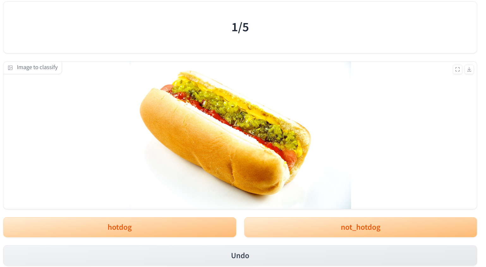

# gradio_image_labelling

Simple gradio app to manually label images.




## Installation

```bash
pip install -r requirements.txt
```

## Usage

```bash
python gradio_app.py \
    --output_file=annotations.json \
    --image_root=./data_to_label/ \
    --classes=hotdog,not_hotdog
```

Arguments:

* `output_file`: The file where the annotations will be saved, in json format
* `image_root`: The directory where the images to label are stored, images can be in subdirectories
* `classes`: A comma separated list of classes to label the images with

Notes:

* If you stop the app before labeling all the images, the annotations will be saved to the output file. If you run the app again with the same output file, it will continue from where you left off.
* Once an image is labeled, the next image will be displayed.
* You can't skip an image but you can add a "skip" class to the classes list

## Output

The output file will be a json file with the following format:

```json
[
    {
        "path": "./data_to_label/name_image_1.jpg",
        "label": "hotdog"
    },
    {
        "path": "./data_to_label/name_image_2.jpg",
        "label": "not_hotdog"
    }
]
```
